# School_District_Analysis  
  
## Overview of the School District Analysis  
  
The school board suspect that some, or all, of the ninth grade class at Thomas High School cheated on their math and reading scholastic aptitude tests.  The possible cheating could skew the data collected prior to identifying the possible academic dishonesty.  As such, the school district asked that I remove the data from the Thomas High School ninth grade clase and repeat the analysis.  
  
### Deliverables  
The school district require the following deliverables:  
1. A data frame with the reading and math scores for Thomas HIgh School (THS) ninth grade students replaced with nulls (np.nan) and merged with the data for each school.  All further deliverables are to be calculated from the data frame with the THS ninth grade scores set to null
2. A data frame with composite school data for all schools in the district  
3. A data summary by school listing  
-  the school name, type (District or Charter), number of students, school budget, budget per student, average math and reading scores, the percent of students passing (>= 70%) math and reading, and the percentage of students that passed both math and reading.  
4. The composite school dataframe sorted to show the five highest and lowest performing schools.  
5. Data frames containing the average reading and math test scores by school.  
6. Data frames containing the average math and reading scores, the percent of students passing math and reading, and the percent passing both math and reading grouped by  
- Ranges of per-student budgetary spending.  
- Ranges of school size (number of students).
- Type of school (Charter or District).  
  
## Data  

The school Board delivered the raw data in two comma separated files:  
[schools_complete](Resources/students_complete.csv)  
[students_complete](Resources/students_complete.csv)  
  
## Results  

- How did removing the THS ninth grade reading and math scores affect the district summary?  
    Removing the THS ninth grade scores (461 students) from the original data set (39,170 students) has minimal impact on the district data  
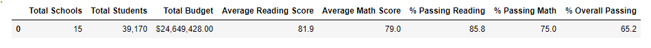  
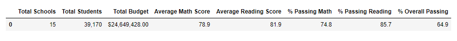  
- How is the school summary affected?  
    Removing the ninth grade students from the THS data did not significantly change the results of the composite analysis.  
    The percentage of students that passed the math and reading exams is slightly lower without the ninth grade data.  
    The average math score is slightly lower and the average reading score is slightly higher without the ninth grade.  
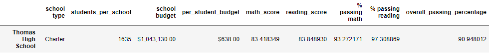  
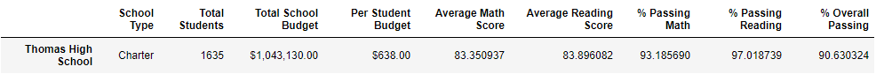  
- How does replacing the ninth graders math and reading scores affect tghomas High School's performance relative to other schools?
    Prior to removing the THS ninth grade scores THS ws the second highest performing school behind Cabrera High School with 91% of students passing both reading and math.  
    After removing the THS ninth grade students exam results THS remains the second highest performing school with only a slight decrease in the percentage of students passing both exams (~0.3% change).  
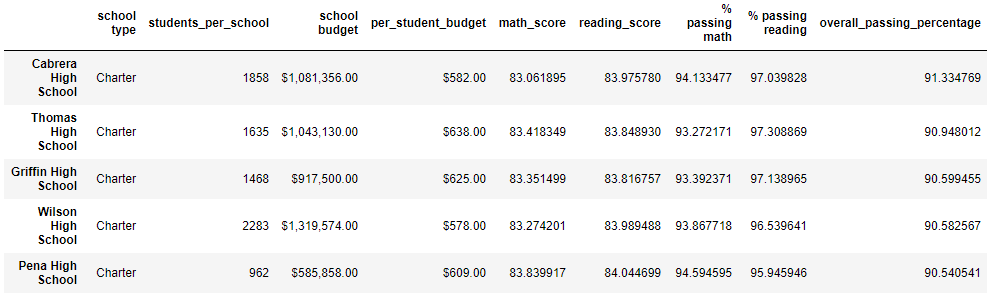  
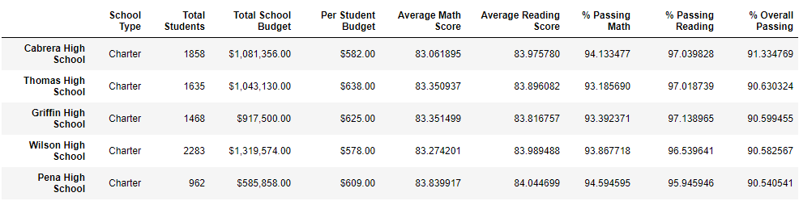  
- How did removing the THS ninth grade data affect the scores by grade, the scores by spending, the scores by size, and the scores by school type?
    The results do not change after removing the THS ninth grade data with the exception of the data by grade and by school.  The data for the THS ninth grade students is nan (null) 
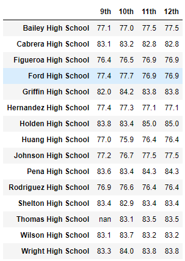  
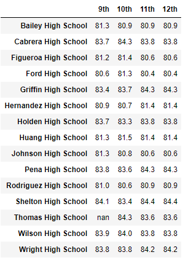  
The updated results of the analysis for scores binned by spending, size, and type are presented below  
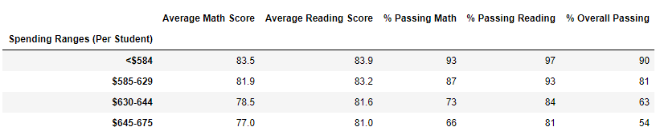  
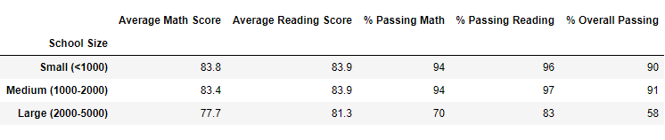  
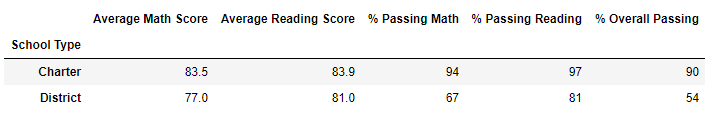  
  
## Summary  

The analysis of scholastic aptitude exam results did not change appreciably after removing the data for the Thomas High School ninth grade class.  

  
